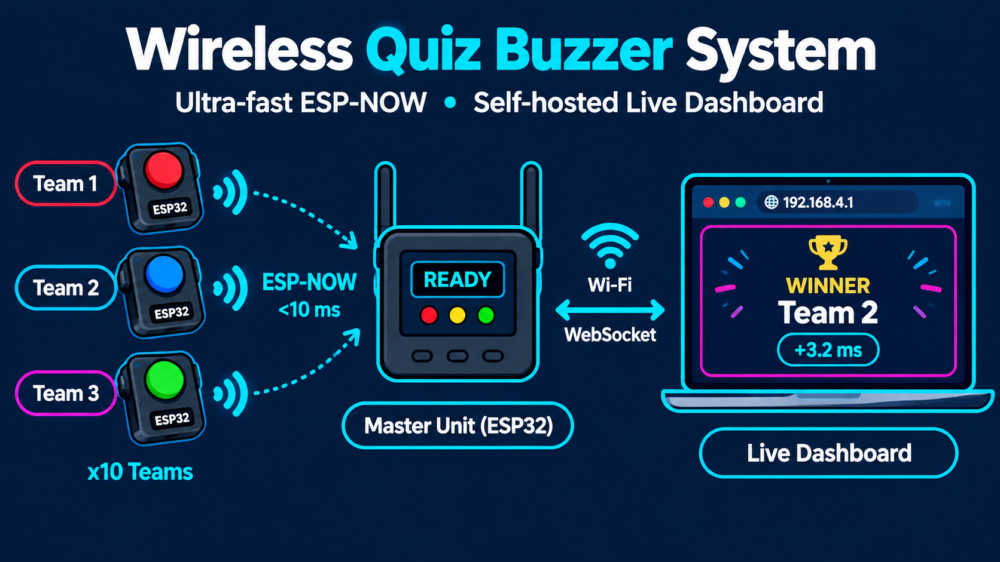

<div align="center">

# 🏆 Quiz Buzzer System 🏆

### Professional Real-Time Quiz Competition Platform

[](https://opensource.org/licenses/MIT)
[](https://www.espressif.com/en/products/socs/esp32)
[](https://platformio.org/)
[](https://developer.mozilla.org/en-US/docs/Web/API/WebSocket)

**[Features](#-features) • [Hardware](#-hardware-requirements) • [Installation](#-installation) • [Usage](#-usage) • [Documentation](#-documentation) • [Contributing](#-contributing)**

---

*A wireless, real-time quiz buzzer system with microsecond precision timing, live dashboard, and professional features for academic competitions.*

</div>

<p align="center">
   
</p>

---

## 🌟 Features

### Hardware Features
-  **10 Independent Teams** with wireless ESP-NOW communication
-  **Sub-millisecond Response Time** (<10ms precision with microsecond timestamps)
-  **50+ Meter Range** (2.4GHz wireless)
-  **Real-time Battery Monitoring** (3-zone health system)
-  **OLED Display** with phase indicators
-  **Physical Controls** (reset button, power switch)
-  **Standalone Operation** (no internet required)

### Dashboard Features
-  **Real-time WebSocket Updates** (instant synchronization)
-  **Two-Phase Quiz System** (LISTEN → READY → ANSWERED)
-  **Background Music** during READY phase
-  **Audio Feedback** (buzzer sounds, winner jingles, voice announcements)
-  **Visual Effects** (confetti animations, smooth transitions)
-  **Team Status Panel** (online/offline, battery levels)
-  **Response Order Display** (with precise timestamps)
-  **Mobile Responsive** design

### Software Features
-  **Smart Broadcast System** (priority-based throttling)
-  **Debounce Protection** (1-second cooldown on reset)
-  **Heartbeat Monitoring** (automatic disconnect detection)
-  **Batch Response Processing** (200ms window optimization)
-  **Modern Web Standards** (HTML5, CSS3, ES6+)

---

## 🛠️ Hardware Requirements

### Master Unit (1x)
| Component | Specification | Purpose |
|-----------|---------------|---------|
| ESP32 Wroom 32 | 38-pin, 4MB Flash | Main controller + WiFi AP |
| OLED Display | 0.96" I2C (128x64) | Status display |
| Push Button | Momentary SPST | Reset/Phase toggle |
| Toggle Switch | SPST | Power control |
| Buzzer | 5V Active | Audio feedback |
| LEDs | 3x (5mm) | Status indicators |
| Power Supply (USB) | 5V 2A | System power |

### Team Buzzer {Slave} Units (10x)
| Component | Specification | Purpose |
|-----------|---------------|---------|
| ESP32 Wroom 32 | 38-pin, 4MB Flash | Team controller |
| Push Button | Momentary SPST | Buzzer button |
| LED | 5mm (any color) | Status indicator |
| Battery | 18650 Li-ion | Portable power |

**Total Cost:** ~$150-200 USD (for complete 10-team system)

---

## 📦 Installation

### Prerequisites
- [PlatformIO IDE](https://platformio.org/) or Arduino IDE
- [Python 3.x](https://www.python.org/)
- USB cables for ESP32 programming
- Git installed

### Quick Start

#### 1️⃣ Clone Repository
```bash
git clone https://github.com/asifahamed-ece/wireless-quiz-buzzer.git
cd wireless-quiz-buzzer
```

#### 2️⃣ Flash Master ESP32
```bash
cd firmware/master
pio run --target upload
cd ../..
```

#### 3️⃣ Upload Dashboard Files
```bash
cd dashboard/data
pio run --target uploadfs
cd ../..
```

#### 4️⃣ Flash Slave ESP32 (Repeat for all 10 teams)
```bash
cd firmware/slave
# Edit src/main.cpp and change TEAM_ID (1-10)
pio run --target upload
cd ../..
```

#### 5️⃣ Connect to Dashboard
1. Power ON master unit
2. Connect to WiFi: `QuizBuzzer_AP` (Password: `12345678`)
3. Open browser: `http://192.168.4.1`

---

## 🎮 Usage

### Quiz Master Operation

#### Starting a Quiz Round

1. **LISTEN Phase** (Question Reading)
   - System starts in LISTEN mode
   - Orange screen displayed
   - All buzzers are IGNORED
   - Read the question to participants

2. **READY Phase** (Buzzer Active)
   - Press RESET button once
   - Screen changes to pink "READY"
   - Background music starts playing
   - Teams can now buzz in

3. **ANSWERED Phase** (Winner Display)
   - First team to buzz locks the system
   - Winner's name displayed with timestamp
   - Music stops, winner jingle plays
   - Voice announces "Team X!"

4. **Next Question**
   - Press RESET button again
   - Returns to LISTEN mode
   - System cleared for next round

### Dashboard Controls
- **Sound Toggle:** Enable/disable audio feedback
- **Live Status:** Monitor team connections in real-time
- **Battery Health:** Check team battery levels
- **Response Order:** View all responses with timestamps

---

## 📸 Project Gallery

<div align="center">

### 🖥️ Dashboard Interface

**Main Dashboard View**

*The primary quiz control interface showing team status and real-time controls*

**Ready Phase Display**

*READY phase with background music indicator and active buzzer monitoring*

**Winner Announcement**

*ANSWERED phase showing winning team with precise response timestamp*

**Team Status Panel**

*Real-time team connection status and battery health monitoring*

</div>

---

<div align="center">

### 🔧 Hardware Assembly

**PCB Fabrication**

*Custom PCB being cut for the master unit circuitry*

**Raw Components**

*3D printed enclosure parts before painting and finishing*

**Painted Enclosure**

*Final painted enclosure with professional finish*

**Internal Layout**

*Internal component arrangement showing ESP32 and wiring*

**Top View**

*Top assembly view with button placement*

**Button Assembly**

*Close-up of push button switches and control interface*

**Side Profile 1**

*Side profile showing port access and mounting points*

**Side Profile 2**

*Alternative side angle with cable management*

</div>

---

<div align="center">

### 🔋 Power System

**Charging Dock**

*Custom charging station for team units*

**Charging in Progress**

*Team unit connected to charger with LED indicator*

**Battery Monitor**

*OLED display showing battery percentage and health status*

</div>

---

<div align="center">

### ✅ Completed Units

**Master Unit - Front**

*Fully assembled master unit with OLED display and controls*

**Master Unit - Angle View**

*Professional finished product ready for deployment*

</div>

---

<div align="center">

### 🎯 Live Demonstration

**Quiz Session in Progress**

*Teams using wireless buzzers during live quiz competition*

**Award Ceremony**

*Winning team celebration with the complete system setup*

</div>

---

## 📊 Technical Specifications

| Feature | Specification |
|---------|---------------|
| **Response Time** | < 10 millisecond |
| **Timing Precision** | Microsecond (μs) timestamps |
| **Communication Protocol** | ESP-NOW (IEEE 802.11) |
| **Wireless Range** | 50+ meters (line of sight) |
| **Max Teams** | 10 simultaneous |
| **Dashboard Update Rate** | Real-time (WebSocket) |
| **Battery Monitoring** | 3-zone system (Green/Yellow/Red) |
| **Display** | 128x64 OLED |
| **Audio** | Web Audio API + Speech Synthesis |
| **Browser Support** | Chrome, Edge, Safari, Firefox |

---

## 🤝 Contributing

We welcome contributions! Here's how you can help:

### Ways to Contribute
- 🐛 Report bugs and issues
- 💡 Suggest new features
- 📝 Improve documentation
- 🔧 Submit pull requests
- ⭐ Star the repository

[📋 Contribution Guidelines](CONTRIBUTING.md)

---

## 📝 License

This project is licensed under the **MIT License** - see the [LICENSE](LICENSE) file for details.

### What this means:
- ✅ Commercial use allowed
- ✅ Modification allowed
- ✅ Distribution allowed
- ✅ Private use allowed
- ℹ️ License and copyright notice required

---

## 🏅 Credits

### Developer
**Asif Ahamed S**  
Electronics and Communication Engineering  
Batch: 2023-2027  
Rajalakshmi Engineering College, Chennai

### Built With
- [ESP32](https://www.espressif.com/) - Microcontroller platform
- [PlatformIO](https://platformio.org/) - Development environment
- [ESPAsyncWebServer](https://github.com/me-no-dev/ESPAsyncWebServer) - Web server
- [ArduinoJson](https://arduinojson.org/) - JSON handling
- [Adafruit GFX](https://github.com/adafruit/Adafruit-GFX-Library) - OLED display

---

## 📧 Contact & Social

**Project Maintainer:** Asif Ahamed S

- GitHub: [@asifahamed](https://github.com/asifahamed-ece)
- Email: asifahamed670@gmail.com
- LinkedIn: [Asif Ahamed S](https://www.linkedin.com/in/asif-ahamed-s-ece)

---

## 🔗 Quick Links

- [Report Bug](https://github.com/asifahamed-ece/wireless-quiz-buzzer/issues)
- [Request Feature](https://github.com/asifahamed-ece/wireless-quiz-buzzer/issues)
- [View Releases](https://github.com/asifahamed-ece/wireless-quiz-buzzer/releases)

---

<div align="center">

**⭐ If you find this project useful, please star it! ⭐**

**Made with ❤️ by Asif Ahamed S**

**© 2026 Rajalakshmi Engineering College**

</div>
